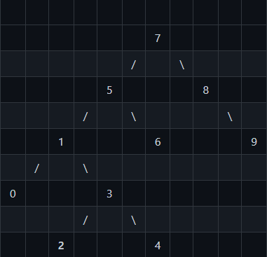

# Binary Seach Tree Prjct.
```
[7, 5, 1, 8, 3, 6, 0, 9, 4, 2] dizisinin Binary-Search-Tree aşamalarını yazınız.
```
### Root = 7

* 7 Root'dur --> 7
* 7'nin solunda 5 olmalı
* 7'nin solundaki 5'in solunda 1 olmalı
* 7'nin sağında 8 olmalı
* 7'nin solundaki 5'in solundaki 1'in sağında 3 olmalı
* 7'nin solundaki 5'in sağında 6 olmalı
* 7'nin solundaki 5'in solundaki 1'in solundaki 0 olmalı
* 7'nin sağındaki 8'in sağında 9 olmalı
* 7'nin solundaki 5'in solundaki 1'in sağındaki 3'ün sağında 4 olmalı
* 7'nin solundaki 5'in solundaki 1'in sağındaki 3'ün solunda 2 olmalı


